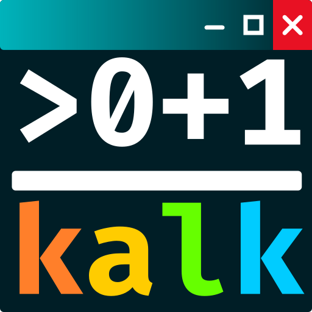

#  KalkGui

A Windows desktop front end for [kalk](https://github.com/xoofx/kalk), the developer calculator with
HLSL-style vectors and matrices, unit conversions, user functions and bit-pattern display.
The kalk engine runs unmodified inside the app.

- Transcript with kalk's syntax colours. `display dev` shows hex and binary breakdowns.
- Input editor: Enter evaluates, Shift+Enter adds a new line, Tab / Ctrl+Space complete, Up/Down browse
  history, F1 opens the docs for the word under the caret, Esc cancels a long evaluation (and, from any other
  control, returns to the input).
- **Docs**: every documented function, including those in modules not imported yet.
- **Library**: every variable and function you define is saved to `~/.kalk/library.kalk` (with the modules
  it needs) and reloaded on every start. Select an entry to edit it in place; renaming replaces it. Entries
  that fail to load stay in the file, flagged, until you fix or delete them. Definitions from `config.kalk`
  are listed but stay in `config.kalk`.
- **Config**: edit `~/.kalk/config.kalk`, save it and restart the engine.

## Build

```
git clone --recurse-submodules <repo>
dotnet build KalkGui.sln
```

Requires the .NET 9 SDK (pinned in `global.json`).

## Credits

kalk is by Alexandre Mutel and released under the BSD-2-Clause license (`external/kalk/license.txt`).
The KalkGui icon is kalk's icon with window caption buttons added to its title bar.
